# ServiceNow Scenario Flows

This document describes the **end-to-end flows** the MCP server currently supports
against ServiceNow — what each tool does, which ServiceNow REST APIs and tables it
touches, and which MCP Apps widget it renders. It is the runtime companion to:

- [README.md](../README.md) — tool inventory and deployment map
- [docs/M365_COPILOT_MCP_APPS.md](M365_COPILOT_MCP_APPS.md) — SEP-1865 widget rendering
- [docs/AUTH_ENTRA_OBO_OKTA.md](AUTH_ENTRA_OBO_OKTA.md) — per-user identity (OBO / caller token)
- [docs/SERVICENOW_SETUP.md](SERVICENOW_SETUP.md) — OAuth app, integration user, roles

> Everything below is **stateless**: each tool call is one HTTP `POST /mcp`. The
> server keeps no session of its own — ServiceNow's server-side cart (`sys_cart`)
> and the caller's identity (forwarded on every request) provide all continuity.

---

## Identity on every call

Before any flow runs, the server resolves the ServiceNow identity for the call in
this priority order (see [AUTH_ENTRA_OBO_OKTA.md](AUTH_ENTRA_OBO_OKTA.md) for detail):

1. **Caller ServiceNow token** — `x-servicenow-access-token` header, used as-is.
2. **Entra OBO exchange** — when `ENTRA_OBO_ENABLED=true`, the inbound user Entra
   token is exchanged for a downstream token ServiceNow accepts (true per-user ACLs).
3. **Configured integration user** — OAuth password / client-credentials grant.
   When this shared identity is used, ownership attribution (below) re-stamps the
   created records to the real ordering user.

`SERVICENOW_REQUIRE_CALLER_ACCESS_TOKEN=true` disables the shared-integration
fallback entirely, so a missing caller identity fails closed.

---

## ServiceNow APIs & tables touched

| Area | ServiceNow endpoint | Table |
|---|---|---|
| Catalog search | `GET /api/sn_sc/servicecatalog/items` | `sc_cat_item` |
| Item form / variables | `GET /api/sn_sc/servicecatalog/items/{sys_id}` | `sc_cat_item` + `item_option_new` |
| Place single order | `POST /api/sn_sc/servicecatalog/items/{sys_id}/order_now` | `sc_request` + `sc_req_item` |
| Cart add | `POST /api/sn_sc/servicecatalog/items/{sys_id}/add_to_cart` | `sys_cart` |
| Cart read | `GET /api/sn_sc/servicecatalog/cart` | `sys_cart` |
| Cart line update | `PUT /api/sn_sc/servicecatalog/cart/{cartItemId}` | `sys_cart_item` |
| Cart line remove | `DELETE /api/sn_sc/servicecatalog/cart/{cartItemId}` | `sys_cart_item` |
| Cart checkout | `POST /api/sn_sc/servicecatalog/cart/submit_order` | `sc_request` + `sc_req_item` |
| List / read orders | `GET /api/now/table/sc_request` | `sc_request` |
| Order line items | `GET /api/now/table/sc_req_item` | `sc_req_item` |
| Approvals | `GET /api/now/table/sysapproval_approver` | `sysapproval_approver` |
| Update order / item | `PATCH /api/now/table/sc_request/{id}` · `PATCH|DELETE /api/now/table/sc_req_item/{id}` | `sc_request` / `sc_req_item` |
| Report incident | `POST /api/now/table/incident` | `incident` |
| List / read incidents | `GET /api/now/table/incident` (caller_id scoped) | `incident` |
| Add incident comment | `PATCH /api/now/table/incident/{id}` (`comments`) | `incident` |
| Incident attachments | `GET /api/now/attachment` · `POST /api/now/attachment/file` | `sys_attachment` |
| Identity lookup | `GET /api/now/table/sys_user` | `sys_user` |

> Reference fields on read paths (`get_order_detail`, etc.) are fetched with
> `sysparm_display_value=all`, so `requested_for`, `approver`, and similar render
> as **display names**, while the underlying `sys_id` stays available for links.

---

## Scenario 1 — Search the catalog

**Tool:** `search_catalog_items` → **widget:** `catalog-browse`

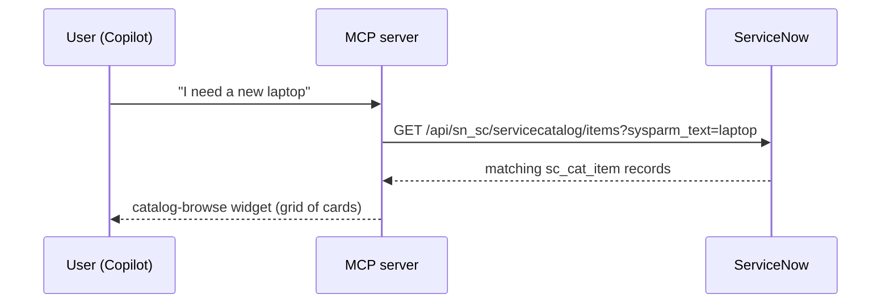

- Free-text query is passed as `sysparm_text`; optional `catalogSysId` /
  `categorySysId` narrow the search; `limit` caps results (1–50, default 25).
- The server derives extra search-term candidates from the phrase to improve recall.
- Picking a card invokes `get_catalog_item_form` for that item.

---

## Scenario 2 — Open & prefill the order form

**Tool:** `get_catalog_item_form` → **widget:** `order-form`

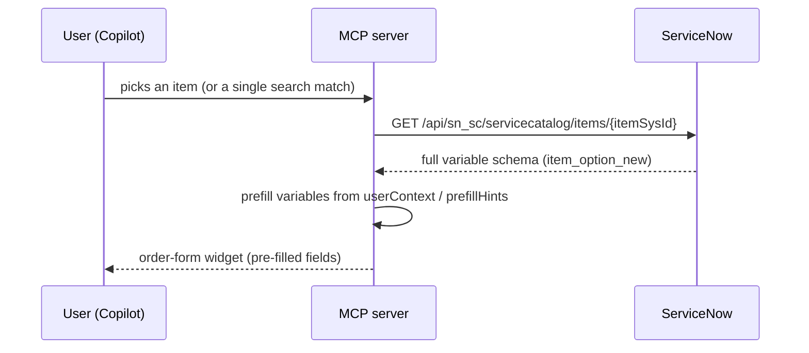

- Returns the item's full variable set (text, choice, reference, checkbox, …).
- `userContext` (free text) and `prefillHints` (structured key/value) let the model
  pre-populate fields like color, storage, carrier, model, justification, quantity.
- Submitting the form calls `place_order`.

---

## Scenario 3 — Place a single order

**Tool:** `place_order` → **widget:** `order-detail` (as confirmation)

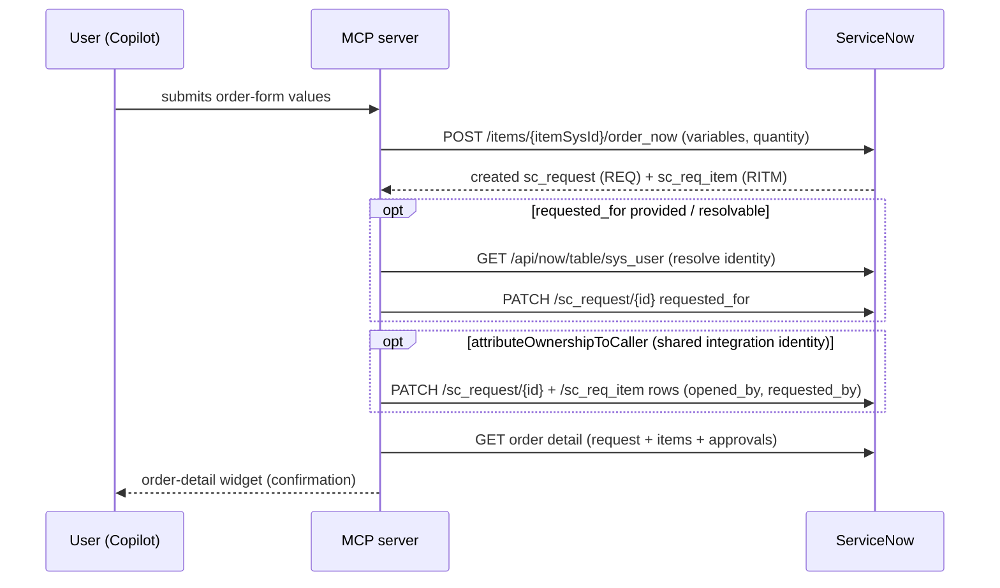

- Mandatory-variable validation runs before submission.
- `requested_for` is resolved against `sys_user` using
  `SERVICENOW_REQUESTED_FOR_LOOKUP_FIELDS` / `..._CALLER_FIELDS`; it can fall back
  to the caller UPN value when `..._FALLBACK_TO_CALLER_VALUE=true`.
- Ownership attribution (`SERVICENOW_ATTRIBUTE_OWNERSHIP_TO_CALLER`, default on)
  re-stamps `opened_by` / `requested_by` so the record shows the real user instead
  of the integration account.
- The confirmation re-renders the created request through the **order-detail**
  widget, so the user sees the ordered item, status, and a ServiceNow link.

---

## Scenario 4 — Multi-item cart & checkout

**Tools:** `add_to_cart`, `view_cart`, `update_cart_item`, `remove_cart_item`,
`submit_cart` → **widgets:** `cart` → `order-detail`

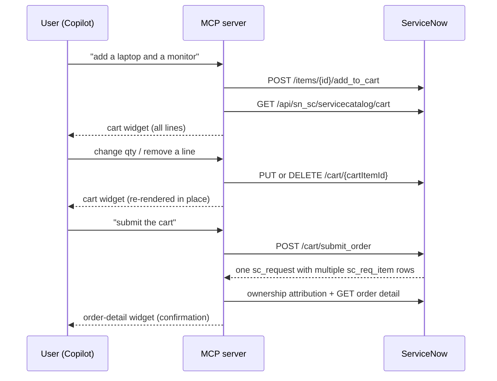

- The cart is ServiceNow's server-side `sys_cart`, keyed to the authenticated user —
  no server-side state of our own, so it persists across stateless MCP calls.
- `add_to_cart` enforces the same mandatory-variable validation as `order_now`,
  then re-fetches the full cart so the widget shows every line.
- Cart lines are keyed by `cartItemId` (the per-line primary key used by update/remove).
- `submit_cart` collapses the whole basket into **one** `sc_request` with multiple
  `sc_req_item` rows — the same shape `get_order_detail` renders — and applies the
  same ownership attribution as `place_order`.

---

## Scenario 5 — List the caller's orders

**Tool:** `list_user_orders` → **widget:** `my-orders`

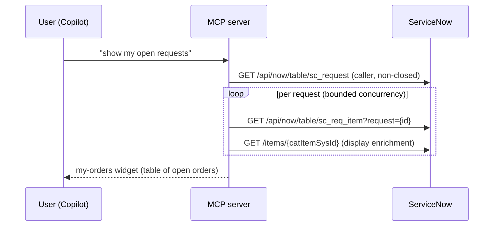

- Returns the caller's current (non-closed) catalog orders, each enriched with its
  request items and catalog display data.
- Side fetches are fan-out-bounded by `SERVICENOW_FANOUT_CONCURRENCY`.
- Clicking a row opens `get_order_detail` for that request.

---

## Scenario 6 — Open a specific order

**Tool:** `get_order_detail` → **widget:** `order-detail`

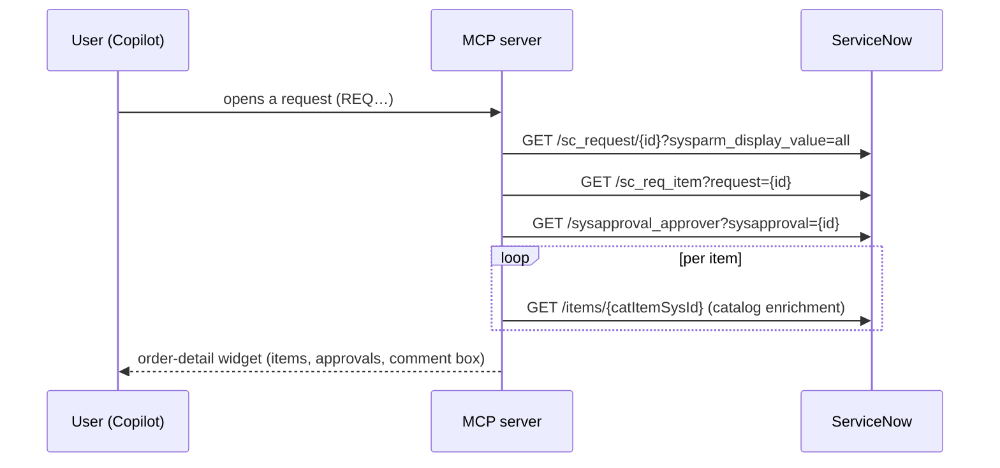

- Fetched with `sysparm_display_value=all` so `requested_for` and approver names
  render as people, not raw sys_ids.
- The widget also surfaces in-place actions (comment, per-item edit/remove,
  cancellation request, "View in ServiceNow").

---

## Scenario 7 — Edit an existing order

**Tools:** `update_order`, `update_order_item`, `remove_order_item` →
**widget:** `order-detail` (re-rendered in place)

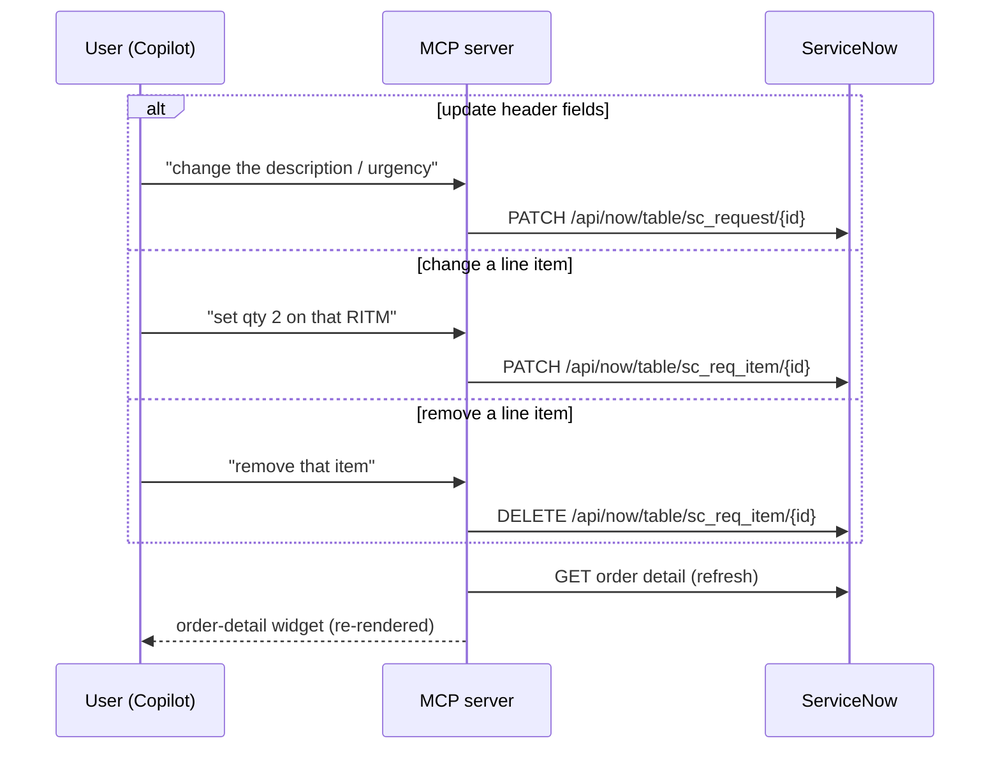

- `update_order` is restricted to a requestor-safe allowlist:
  `short_description`, `description`, `comments`, `urgency`, `priority`.
- `update_order_item` allows `quantity`, `comments`, `short_description`,
  `description` on a single `sc_req_item`; the parent order is resolved from the
  item when `orderSysId` is omitted.
- `remove_order_item` deletes one line without cancelling the whole request.
- All three re-fetch and re-render the **order-detail** widget so the change is
  reflected immediately.

---

## Scenario 8 — Validate connectivity

**Tool:** `validate_servicenow_config` → no widget (text result)

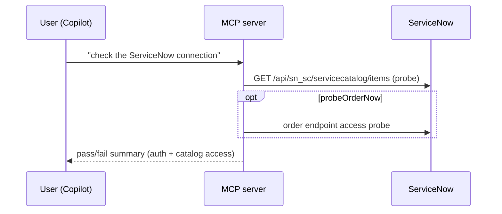

- Verifies OAuth and catalog API access end-to-end.
- `forceConfiguredCredentials` tests the shared integration grant explicitly;
  `probeOrderNow` (with `orderProbeItemSysId` / `orderProbeVariables`) optionally
  checks order-endpoint access without placing a real order.

---

## Scenario 9 — Report an incident

**Tools:** `get_incident_form` → incident-form · `report_incident` → incident-detail

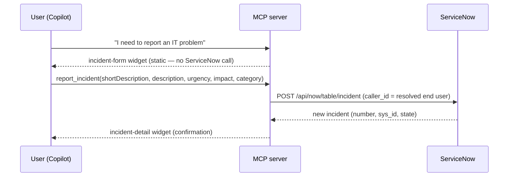

- `get_incident_form` renders a **static** report form (no ServiceNow round-trip);
  the model may prefill fields from conversation context.
- `report_incident` creates the record and stamps **`caller_id`** with the real end
  user (best-effort `opened_by` when ownership attribution is on). Only
  `shortDescription` is required; `description` / `category` / `urgency` / `impact`
  are optional.
- The result renders the **incident-detail** widget so the user immediately sees the
  created incident with its number and status.

---

## Scenario 10 — Track your incidents

**Tools:** `list_user_incidents` → my-incidents · `get_incident_detail` → incident-detail

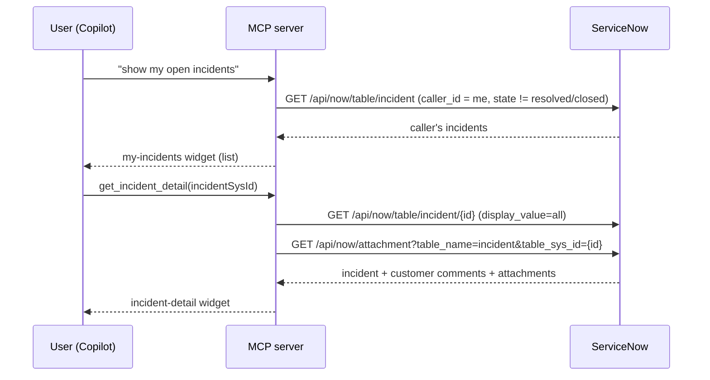

- `list_user_incidents` is **scoped to the caller's own incidents** (`caller_id`) and
  excludes resolved/closed records by default. Renders the **my-incidents** widget,
  which has an inline detail view (2-state, like my-orders).
- `get_incident_detail` reads the record with `sysparm_display_value=all`. The
  **customer-visible comments** are parsed from the incident record's own `comments`
  journal field (no `sys_journal_field` query — so non-admin callers can read them),
  and attachments are listed from `sys_attachment`.

---

## Scenario 11 — Comment on & attach to an incident

**Tools:** `add_incident_comment` · `add_incident_attachment` → incident-detail

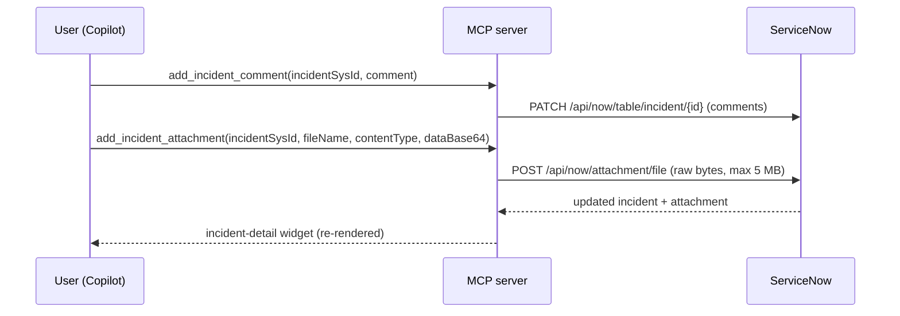

- `add_incident_comment` writes a **customer-visible** additional comment (the
  `comments` field, not `work_notes`).
- `add_incident_attachment` accepts the file as **base64 in the tool call** (the only
  authenticated channel a sandboxed widget has), decodes it to raw bytes, enforces a
  **5 MB** cap, and POSTs to `/api/now/attachment/file`. The incident-detail and
  my-incidents widgets expose a file picker + attachment list for this.
- Both re-fetch and re-render the **incident-detail** widget so the comment/attachment
  appears immediately.

---

## Tool → widget → ServiceNow quick reference

| Tool | Widget | Primary ServiceNow call |
|---|---|---|
| `search_catalog_items` | catalog-browse | `GET /servicecatalog/items` |
| `get_catalog_item_form` | order-form | `GET /servicecatalog/items/{id}` |
| `place_order` | order-detail | `POST /items/{id}/order_now` |
| `add_to_cart` | cart | `POST /items/{id}/add_to_cart` |
| `view_cart` | cart | `GET /servicecatalog/cart` |
| `update_cart_item` | cart | `PUT /servicecatalog/cart/{cartItemId}` |
| `remove_cart_item` | cart | `DELETE /servicecatalog/cart/{cartItemId}` |
| `submit_cart` | order-detail | `POST /servicecatalog/cart/submit_order` |
| `list_user_orders` | my-orders | `GET /table/sc_request` |
| `get_order_detail` | order-detail | `GET /table/sc_request/{id}` |
| `update_order` | order-detail | `PATCH /table/sc_request/{id}` |
| `update_order_item` | order-detail | `PATCH /table/sc_req_item/{id}` |
| `remove_order_item` | order-detail | `DELETE /table/sc_req_item/{id}` |
| `get_incident_form` | incident-form | _(static form — no ServiceNow call)_ |
| `report_incident` | incident-detail | `POST /table/incident` |
| `list_user_incidents` | my-incidents | `GET /table/incident` (caller_id scoped) |
| `get_incident_detail` | incident-detail | `GET /table/incident/{id}` (comments from the record journal) |
| `add_incident_comment` | incident-detail | `PATCH /table/incident/{id}` (comments) |
| `add_incident_attachment` | incident-detail | `POST /api/now/attachment/file` |
| `validate_servicenow_config` | — | `GET /servicecatalog/items` (probe) |

> MCP Apps is always on: the cart, order-item, and incident tools (and all
> widgets) are always registered, and every widget-backed tool returns compact
> `structuredContent` plus a concise, neutral `content` summary.
>
> **Incident management (end users)** mirrors the catalog flow: `get_incident_form`
> opens the report form → `report_incident` creates the incident and renders the
> incident-detail confirmation → `list_user_incidents` / `get_incident_detail`
> track it → `add_incident_comment` adds a customer-visible comment. Incidents
> are attributed to the real end user via `caller_id` and the list/detail views
> are scoped to the caller's own incidents. The detail widget also lets the user
> attach a file/screenshot (`add_incident_attachment`, max 5 MB).
